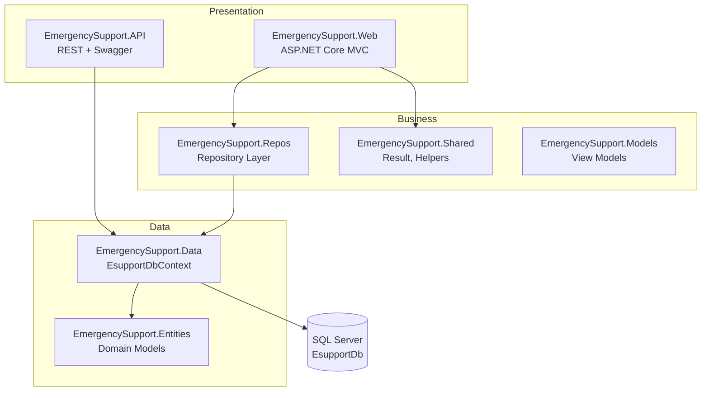
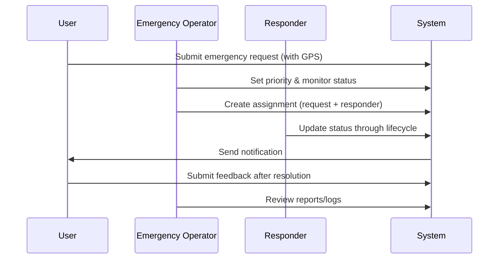

# Emergency Support System

**A production-style emergency response platform built with ASP.NET Core 8 — designed to demonstrate enterprise .NET skills recruiters look for.**

[](https://dotnet.microsoft.com/)
[](https://dotnet.microsoft.com/apps/aspnet)
[](https://learn.microsoft.com/ef/core/)
[](https://www.microsoft.com/sql-server)
[](https://github.com)

---

## Executive Summary

**Emergency Support System** is a full-stack web application for coordinating emergency incidents end-to-end: from citizen or staff reporting, through operator triage and prioritization, to responder dispatch, status tracking, notifications, feedback, and audit logging.

The solution is structured as a **multi-project .NET solution** with clear separation of concerns — the same architectural approach used in professional enterprise codebases. It showcases skills directly relevant to **backend / full-stack .NET developer** roles: MVC, Web API, EF Core, SQL Server, authentication, authorization, and maintainable data access patterns.

---

## Why This Project Matters

| Business problem | How the system addresses it |
|------------------|------------------------------|
| Fragmented emergency reporting | Centralized emergency request intake with type, description, and GPS coordinates |
| Slow dispatch | Assignment workflow linking requests to available responders |
| Lack of visibility | Status and priority management with role-based dashboards |
| Accountability | Reports/logs, notifications, and post-incident feedback |

---

## Key Highlights for Recruiters

- **Layered solution architecture** — 7 projects with single responsibility per layer  
- **Repository pattern** with a unified `Result<T>` wrapper for predictable error handling  
- **Claims-based cookie authentication** with role-driven authorization on controllers  
- **Dual entry points** — MVC web app for operations + REST API with Swagger  
- **Entity Framework Core 8** with SQL Server and relational domain modeling  
- **Real-world domain modeling** — Users, requests, responders, assignments, notifications, feedback, audit logs  

---

## Tech Stack

| Layer | Technologies |
|-------|----------------|
| **Backend** | C#, .NET 8, ASP.NET Core MVC, ASP.NET Core Web API |
| **Data** | Entity Framework Core 8, Microsoft SQL Server |
| **Patterns** | Repository pattern, layered architecture, dependency injection |
| **Security** | Cookie authentication, claims, role-based authorization |
| **Frontend** | Razor Views, Bootstrap, jQuery Validation |
| **API docs** | Swagger / OpenAPI (Development) |

---

## Features

### Authentication & Users
- User registration and login with cookie-based authentication (`EsAuth`)
- Role-based access: **Admin**, **User**, **Emergency Operator**, **Responder**
- Claims for identity, role, user ID, and email

### Emergency Operations
- **Emergency Requests** — Create, view, edit, and delete incidents with emergency type, description, latitude/longitude, priority, and status
- **Responders** — Manage field personnel with service type, availability status, and current GPS location
- **Assignments** — Dispatch responders to requests; track assigned, arrival, and completion times
- **Status & Priority** — Operators and responders update request status; operators set priority levels

### Communication & Quality
- **Notifications** — Per-user messages with read/unread tracking
- **Feedback** — Ratings and comments tied to completed requests
- **Reports & Logs** — Operator-facing audit trail of system actions

---

## Solution Architecture



### Project Structure

```
EmergencySupport.Web.sln
│
├── EmergencySupport.Web          # MVC UI, authentication, authorization
├── EmergencySupport.API          # REST API endpoints
├── EmergencySupport.Repos        # Repository layer (CRUD + business queries)
├── EmergencySupport.Data         # EF Core DbContext
├── EmergencySupport.Entities     # Domain entities / database models
├── EmergencySupport.Models       # Login and view-specific models
└── EmergencySupport.Shared       # Shared types (Result<T>, CurrentUserHelper)
```

### Design Decisions

| Decision | Rationale |
|----------|-----------|
| **Repository pattern** | Decouples controllers from EF Core; easier to test and maintain |
| **`Result<T>` responses** | Consistent success/error handling across the data layer |
| **Shared DbContext** | Single source of truth for Web and API |
| **Role-based authorization** | Enforces least-privilege access per user type |
| **Separate API project** | Enables future mobile or third-party integrations |

---

## Skills Demonstrated

```
✓ C# & .NET 8                    ✓ ASP.NET Core MVC
✓ ASP.NET Core Web API           ✓ Entity Framework Core
✓ SQL Server                     ✓ Dependency Injection
✓ Repository Pattern             ✓ Layered Architecture
✓ Authentication & Authorization ✓ Claims-based Security
✓ RESTful API Design             ✓ Swagger / OpenAPI
✓ Razor Views & Bootstrap        ✓ Error Handling Patterns
```

---

## Domain Model

| Entity | Purpose |
|--------|---------|
| `Users` | Accounts with role, contact info, and active status |
| `EmergencyRequests` | Incident reports with location, priority, and status |
| `Responders` | Field staff linked to users with availability and GPS |
| `Assignments` | Request–responder dispatch with lifecycle timestamps |
| `Notifications` | User alerts and read state |
| `Feedback` | Post-incident ratings and comments |
| `ReportsLogs` | Audit trail of actions |

---

## Role-Based Access

| Role | Typical responsibilities |
|------|--------------------------|
| **User** | Submit and manage own emergency requests |
| **Responder** | View assignments; update request status |
| **Emergency Operator** | Set priorities, view reports/logs, coordinate incidents |
| **Admin** | Full operational access including responder and assignment management |

---

## Getting Started

### Prerequisites

- [.NET 8 SDK](https://dotnet.microsoft.com/download/dotnet/8.0)
- [SQL Server](https://www.microsoft.com/sql-server) (Express or Developer edition)
- Visual Studio 2022, VS Code, or Rider (recommended)

### 1. Clone the repository

```bash
git clone https://github.com/<your-username>/emergency-support-system.git
cd emergency-support-system
```

### 2. Configure the database

Update the connection string in both:

- `EmergencySupport.Web/appsettings.json`
- `EmergencySupport.API/appsettings.json`

```json
{
  "ConnectionStrings": {
    "EsupportDb": "Server=localhost;Database=EsupportDb;Trusted_Connection=True;TrustServerCertificate=True;"
  }
}
```

### 3. Create the database

Ensure SQL Server is running, then apply EF Core migrations from the solution root:

```bash
dotnet ef database update --project EmergencySupport.Data --startup-project EmergencySupport.Web
```

> If migrations are not yet in the repository, generate them first:
> ```bash
> dotnet ef migrations add InitialCreate --project EmergencySupport.Data --startup-project EmergencySupport.Web
> dotnet ef database update --project EmergencySupport.Data --startup-project EmergencySupport.Web
> ```

### 4. Run the web application

```bash
dotnet run --project EmergencySupport.Web
```

Navigate to the HTTPS URL shown in the console. Register an account, sign in, and explore the workflow.

### 5. Run the API (optional)

```bash
dotnet run --project EmergencySupport.API
```

Open `/swagger` in Development to explore REST endpoints.

---

## API Overview

| Controller | Sample endpoints |
|------------|------------------|
| **Users** | `GET /api/Users/getUsers` · `GET /api/Users/byID/{id}` · `POST /api/Users` · `DELETE /api/Users/{id}` |
| **Responders** | `GET /api/Responders/getResponders` · `GET /api/Responders/byID/{id}` |
| **ReportsLogs** | CRUD operations for audit logs |

The API shares the same `EsupportDbContext` and SQL Server database as the MVC application.

---

## Typical Workflow



1. **User** registers and signs in  
2. **User** creates an emergency request with location and details  
3. **Emergency Operator** sets priority and tracks status  
4. **Admin / Operator** assigns a responder to the request  
5. **Responder** updates status until completion  
6. **User** receives notifications and submits feedback  
7. **Operator** reviews audit logs for accountability  

---

## Screenshots

> Add 2–3 screenshots here to significantly improve first impressions for recruiters and hiring managers.

| Dashboard | Emergency Requests | Assignments |
|:---------:|:------------------:|:-----------:|
| *Coming soon* | *Coming soon* | *Coming soon* |

---

## Roadmap & Improvements

Planned enhancements that reflect continued professional growth:

- [ ] ASP.NET Core Identity with password hashing
- [ ] Unit and integration tests (xUnit, WebApplicationFactory)
- [ ] Real-time updates with SignalR
- [ ] Map-based responder tracking (e.g. Leaflet / Azure Maps)
- [ ] CI/CD pipeline (GitHub Actions)
- [ ] Docker support for local and cloud deployment

---

## What I Learned

Building this project strengthened my understanding of:

- Structuring maintainable **multi-project .NET solutions**
- Applying the **repository pattern** without over-abstracting
- Implementing **authentication and role-based authorization** in ASP.NET Core
- Modeling a **relational domain** with EF Core and SQL Server
- Exposing the same data through **MVC** and a **REST API**

---

## Author

**Your Name**  
.NET Developer · Full-Stack ASP.NET Core

[](https://github.com/fahimkarim01)
[](https://www.linkedin.com/in/mdfahimkarim/)

> Replace placeholders above with your actual name and profile links before publishing.

---

## License

This project was developed as a portfolio and academic demonstration.  
Specify a license (e.g. [MIT](https://opensource.org/licenses/MIT)) or contact the author for usage terms.

---

<p align="center">
  <sub>Built with ASP.NET Core 8 · Entity Framework Core · SQL Server</sub>
</p>
